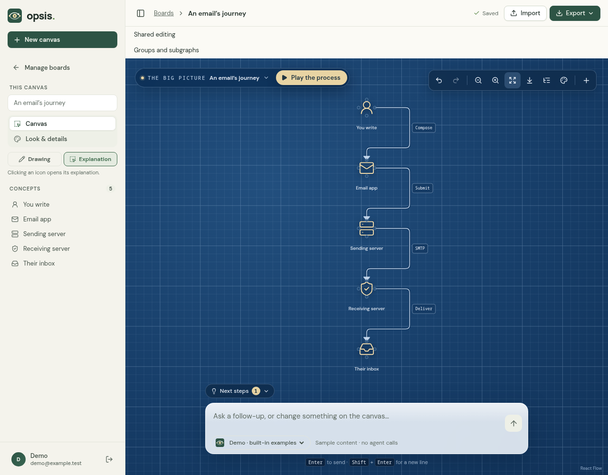
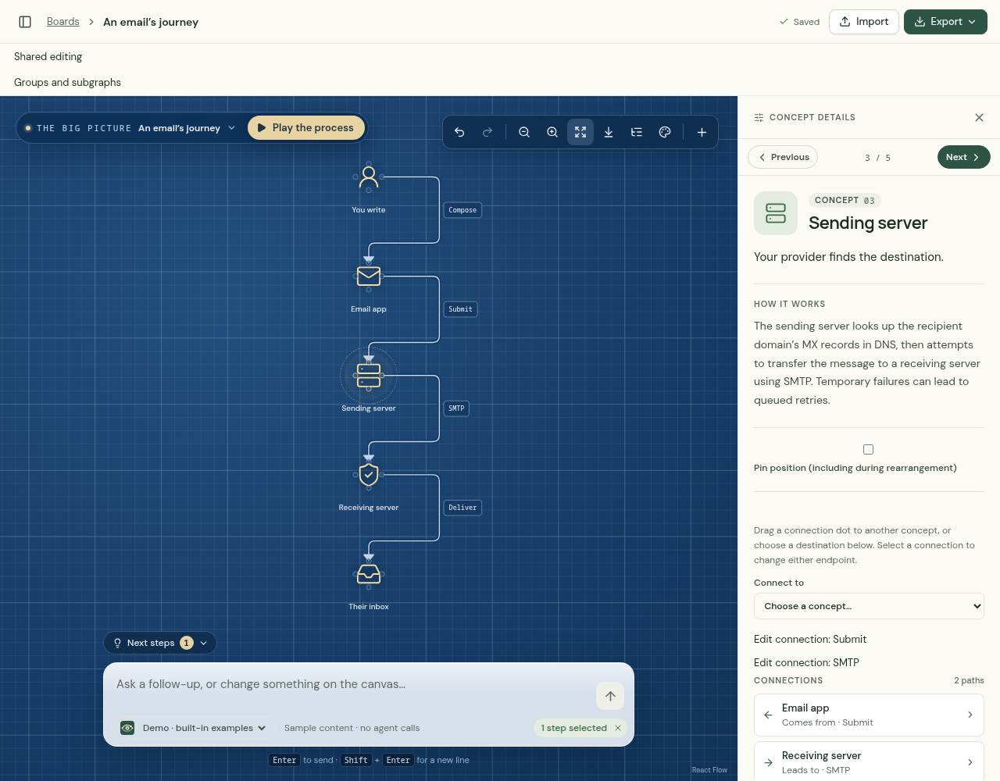

# Opsis

[](https://github.com/Pyp-3/Opsis/actions/workflows/ci.yml)

**See what you mean.** Turn questions into editable diagrams, explore each concept, and play a process step by step.

[Download](https://github.com/Pyp-3/Opsis/releases) · [Getting started](docs/GETTING-STARTED.md) · [Documentation](docs/README.md) · [Roadmap](GOALS.md)

## Demonstration

Try it without an agent subscription or model calls:

1. Create a local account and open **An email’s journey** from Home.
2. Select an icon to explore it. Drag concepts to rearrange the flow.
3. Choose **Play the process**, or export your diagram to share it.



_Follow the connections, then select a concept for its explanation._



## What you can do

- Generate and refine diagrams with Claude/Codex CLIs or Kimi, Grok and Antigravity APIs/CLIs; review proposed changes before applying them. See [provider setup and limits](docs/PROVIDERS.md).
- Save model profiles and fallback choices to your account; switch to a fallback explicitly without automatic retries.
- Use **Canvas** for the diagram and live generation progress, and **Chat** for private per-account threads tied to each board and provider/model. Threads continue indefinitely: the agent keeps running notes, sees whether you applied or discarded its proposals, and Claude/Codex CLI threads resume their own saved sessions. A third tab is reserved for a future feature.
- Link concepts to other boards, follow them and return; see incoming links from boards you can access.
- Edit connections, collapse groups, attach notes and sources, and reuse boards as templates.
- Sketch on the canvas beside the icons, for example floor plans, outlines, arrows, labels and dimension lines, to combine process flows with engineering and architecture drawings. Select several drawings, resize and rotate them with handles, copy and paste them between boards, organise them on layers that can be hidden or locked, and set a board scale so dimensions read in real units. The chat agent can add a reviewed sketch on its own layer; select your own drawings to put them in focus and the agent works drawing-first and proposes reviewed edits to exactly those. Agents connected over MCP can draw too.
- Save locally with SQLite, group boards into private collections, undo history, revisions and recovery; invite named accounts on the same server to edit.
- Import text or existing diagrams; export editable JSON, images or Markdown.
- Share every board in a collection at once; export/import linked collection bundles, download one read-only HTML file, or print a walkthrough to PDF.
- Plan API token costs in Settings with dated pricing presets or custom rates, explicit token assumptions and a cumulative cost chart. Assumptions follow your account; projections make no model calls.
- Let your own agents work on canvases through [MCP](apps/mcp/README.md).

## Run Opsis

**Linux desktop:** download the desktop tarball from [Releases](https://github.com/Pyp-3/Opsis/releases), extract it, and run `opsis`. GTK 3 and WebKitGTK 4.1 are required. See the [desktop guide](docs/DESKTOP.md) for builds and Hyprland setup. **Windows desktop:** run the `windows-x64-setup.exe` from the same release (per-user, no admin rights; it offers one-click updates), or use the portable `windows-x64.zip`. It uses the WebView2 runtime included with Windows 11. **macOS:** Intel and Apple Silicon app bundles for macOS 15+ pass native CI checks; packages are ad-hoc signed, without Developer ID signing or notarization. See the [macOS guide](docs/DESKTOP.md#macos).

**Browser development:** install Node.js 20.19+, pnpm 10.34.5, Rust via rustup and a native compiler, then:

```sh
git clone https://github.com/Pyp-3/Opsis.git
cd Opsis
./opsis dev
```

Open **http://localhost:3000**. For native Windows and troubleshooting, see [Getting started](docs/GETTING-STARTED.md).

Your boards stay on your machine. Agent generation sends your prompt and supplied context through the selected provider and may consume its quota. Keep the server on loopback; public hosting is not supported.

[User guide](docs/USER-GUIDE.md) · [Agent settings](docs/AGENT-CONFIGURATION.md) · [Contributing](CONTRIBUTING.md) · [Release notes and packaging](docs/RELEASES.md)
